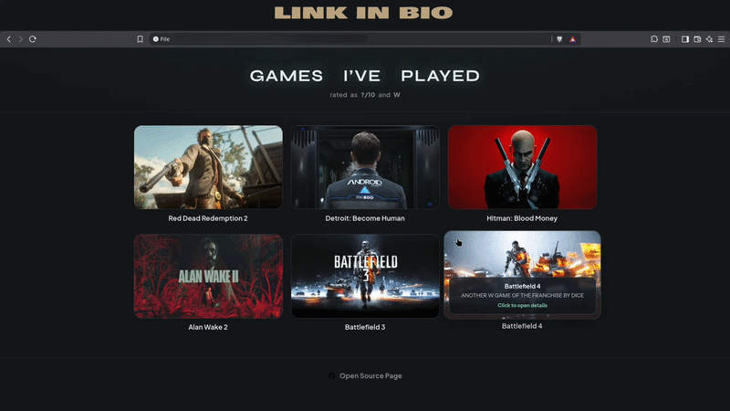

<h1 align="center">Games WEB PAGE For Gamers</h1>

<p align="center">
    
    
    
    
</p>

### 🌍 WEBSITE VIEW : https://elliotterminal.github.io/Games-Website/

### ▶︎ Preview :


### √ Description :

This Web Page - Shows number of games played, in form of cards, till date. Using stylish UI in every details for better visuals and graphics. Gamers can publish such pages in their social media handle to keep their viewers and followers updated.

This Web Page is made as a **P R O J E C T**.

Do not use the source code of this Web Page for ill intention.

### + General Description - 

# Games I’ve Played — visual showcase

UI ideas in Site: one card per game (banner + title), hover effect, click opens a card with whatever details admin adds.

## Customize your list

In [`js/games-data.js`](js/games-data.js), Each entry means:

| Fields     | Purpose                                                  |
|------------|----------------------------------------------------------|
| `name`     | Title of the game on the card (required).                |
| `banner`   | Image URL or path (e.g. `./banners/game_name.jpg`).      |
| `bannerAlt`| Short alt text for the image.                            |
| `summary`  | One-line takeaway in the modal.                          |
| `meta`     | Key/value chips (platform, hours, etc.).                 |
| `body`     | Detailed paragraphs (longer notes).                      |
| `links`    | `{ "Platform (Steam),(Epic),etc.": "https://...", ... }` |

Replace the given entries with your real games.

##### For cloning this repository -

- ```https://github.com/ElliotTerminal/Games-Website.git```

### Provided:
 
- README.md .
- main page is [`index.html`](index.html).
- [`banners/(all the banner images and icons)`](/banners).
- [`css/style.css`](css/style.css)
- [`js/(all the javascript files)`](/js).

## ! Disclaimer
***This Web Page is developed for educational purposes. 
   Here it demonstrates how one can showcase the number of games he/she played till date with personal rates.  
   You have your own responsibilities and you are liable to any damage or violation of laws by using the source code of your own project. 
   The creator is not responsible for any misuse of the codes!***

### This repository is open source to all. Make sure to give credit on your GitHub repository or Social Media before using the source code of the Web Page. Show your support for this Open Source developer.

####  If this source code helped you, please consider sharing and staring this repository. Your stars will motivate me a lot!
